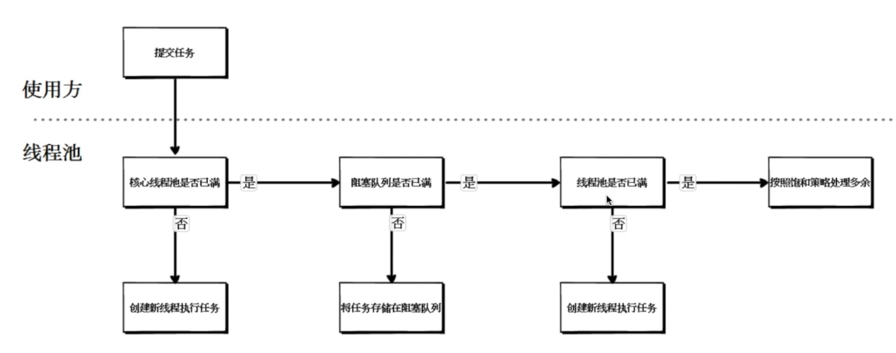

# 线程池
### 线程池的核心参数
```
/**
 * @param corePoolSize    核心线程数量
 * @param maximumPoolSize 最大线程数量
 * @param keepAliveTime   线程空闲后的存活时间
 * @param unit            时间单位
 * @param workQueue       用于存放任务的阻塞队列
 * @param threadFactory   线程工厂类
 * @param handler         当队列和最大线程池都满了之后的饱和政策
 */
public ThreadPoolExecutor(int corePoolSize, 
                          int maximumPoolSize, 
                          long keepAliveTime, 
                          TimeUnit unit,
                          BlockingQueue<Runnable> workQueue, 
                          ThreadFactory threadFactory,
                          RejectedExecutionHandler handler) {}
```

### 线程池的处理流程


### 线程池可选择的阻塞队列
- 无界队列
- 有界队列
- 同步移交队列